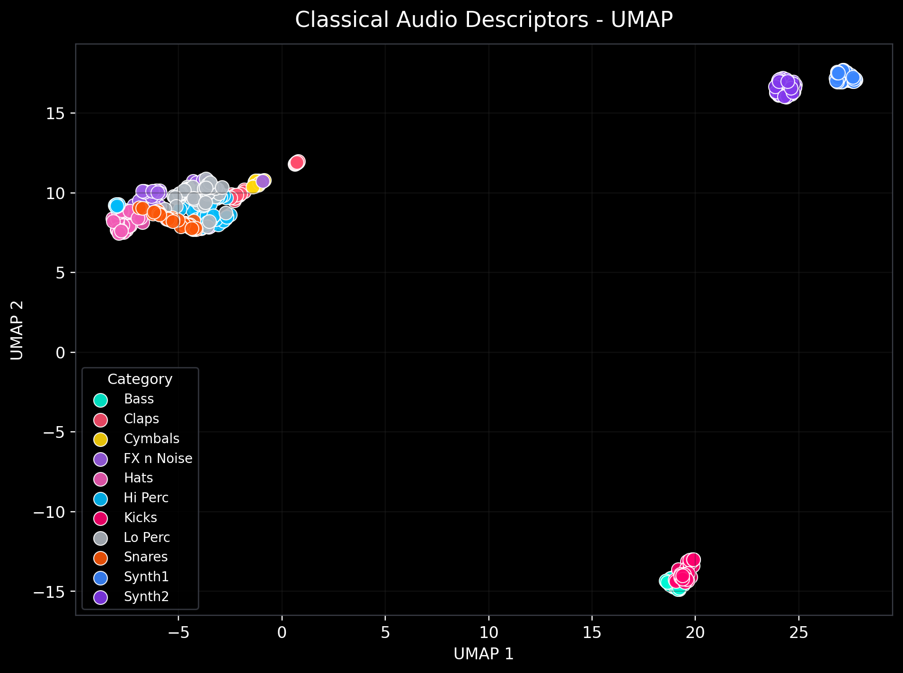
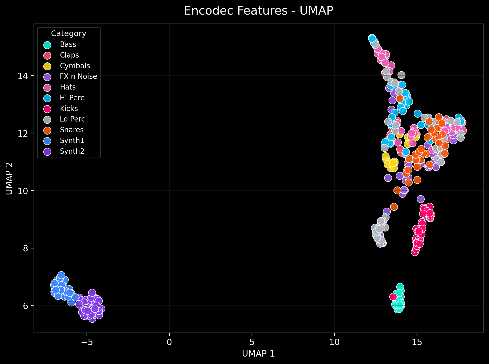
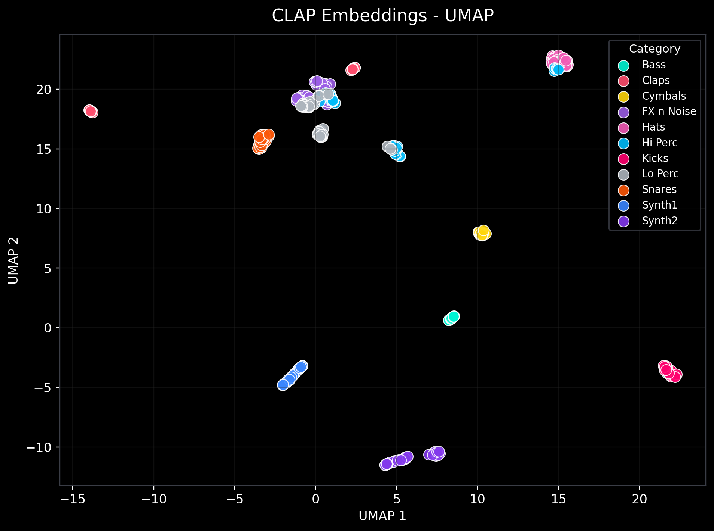

# 🎛️ Techno Audio Representations

> Comparing classical signal processing, neural codec (EnCodec), and multimodal audio-language (CLAP) feature representations on a curated techno sample dataset.

---

## 🧠 What is this?

This project explores **how different audio feature representations capture the sonic identity of techno music samples**. Starting from a real-world sample pack, three fundamentally different approaches are used to turn raw audio into numbers, and then compared by how well they cluster sound categories in 2D space.

The three representations are:

| Representation | Description |
|---|---|
| 🎚️ **Classical** | Hand-crafted signal features: MFCCs, chroma, spectral centroid/bandwidth/rolloff, ZCR, RMS, onset strength |
| 🔢 **EnCodec** | Neural audio codec discrete token statistics from Meta's EnCodec (24 kHz, 6 kbps) |
| 🌐 **CLAP** | 512-dimensional audio embeddings from LAION's Contrastive Language–Audio Pretraining model |

Each representation is evaluated by projecting samples into 2D with **PCA** and **UMAP**, then measuring cluster separation via **Silhouette Score**.

---

## 📦 Dataset

The dataset comes from **[MusicRadar](https://www.musicradar.com/news/tech/free-music-samples-royalty-free-loops-hits-and-multis-to-download)** — specifically the *Warehouse Techno Samples* and *Rave Synth Samples* packs. These are royalty-free sample packs widely used in electronic music production.

Samples are organised into **11 sound categories**:

```
data/music_radar/
├── Bass/
├── Claps/
├── Cymbals/
├── FX n Noise/
├── Hats/
├── Hi Perc/
├── Kicks/
├── Lo Perc/
├── Snares/
├── Synth1/
└── Synth2/
```

Each subdirectory name becomes the **class label** used in the visualisations and silhouette evaluation. Audio files are trimmed to a maximum of **4 seconds** and resampled as required by each extractor (24 kHz for EnCodec/classical, 48 kHz for CLAP).

---

## 🗂️ Project Structure

```
techno-representation/
├── app.py                          # Streamlit interactive explorer
├── requirements.txt
├── techno_audio_representations.ipynb   # Main analysis notebook
├── scripts/
│   └── run_pipeline.py             # CLI pipeline: extract → reduce → plot
├── src/
│   ├── features.py                 # Feature extractors (classical, EnCodec, CLAP)
│   ├── analysis.py                 # PCA, UMAP, t-SNE, silhouette scoring
│   ├── data_utils.py               # Dataset scanner
│   └── visualization.py            # Scatter plot renderer (dark techno theme)
├── data/
│   ├── music_radar/                # Raw audio samples (by category)
│   └── features_musicradar/        # Extracted CSVs (generated by pipeline)
└── figures_musicradar/             # Output PNG scatter plots
```

---

## ⚙️ Setup

**Requirements:** Python 3.11+, a virtual environment is recommended.

```bash
# Clone the repo
git clone https://github.com/martiinsssssss/techno-representation.git
cd techno-representation

# Create and activate a virtual environment
python -m venv .venv
source .venv/bin/activate        # macOS / Linux
# .venv\Scripts\activate         # Windows

# Install dependencies
pip install -r requirements.txt
```

---

## 🚀 Running the Pipeline (Terminal)

The CLI script scans the audio dataset, extracts all three feature sets, reduces them with PCA and UMAP, saves CSVs and PNG plots, and prints the final silhouette scores.

```bash
python -m scripts.run_pipeline \
    --data_dir  data/music_radar \
    --output_dir data/features_musicradar
```

Output files written to `data/features_musicradar/`:

| File | Contents |
|---|---|
| `features.csv` | Full feature matrix (all three representations) |
| `classical_pca.csv` / `classical_umap.csv` | 2D projections for classical features |
| `encodec_pca.csv` / `encodec_umap.csv` | 2D projections for EnCodec features |
| `clap_pca.csv` / `clap_umap.csv` | 2D projections for CLAP features |
| `silhouette_scores.csv` | Silhouette score per representation |

PNG scatter plots are saved to `figures_musicradar/`.

---

## 📓 Running the Notebook

The notebook `techno_audio_representations.ipynb` walks through the full analysis interactively — loading pre-computed features, visualising embeddings, comparing silhouette scores, and inspecting individual sounds.

```bash
# Make sure the virtual environment is active, then:
jupyter notebook techno_audio_representations.ipynb
# or
jupyter lab
```

The notebook assumes the pipeline has already been run and `data/features_musicradar/` exists. If not, run the CLI pipeline first (see above).

---

## 🖥️ Interactive Streamlit App

A dark-themed Streamlit app lets you explore the embeddings interactively — switch representations, hover over points to hear samples, and inspect spectrograms.

```bash
streamlit run app.py
```

Then open [http://localhost:8501](http://localhost:8501) in your browser.

---

## 📊 Example Results

Scatter plots (UMAP, dark theme) are pre-generated in `figures_musicradar/`:

| Classical UMAP | EnCodec UMAP | CLAP UMAP |
|:---:|:---:|:---:|
|  |  |  |

---

## 🔬 Key Findings

- **CLAP** produces the most semantically coherent clusters — categories like *Kicks*, *Snares*, and *Synth* are well separated, reflecting its training on audio-language pairs.
- **EnCodec** captures codec-level texture patterns and shows reasonable grouping, but merges some timbral neighbours.
- **Classical** features perform surprisingly well for simple spectral categories (e.g. *Hats* vs *Kicks*) but struggle with semantically similar textures.

---

## 📚 References

- [EnCodec — Meta AI](https://github.com/facebookresearch/encodec)
- [CLAP — LAION](https://github.com/LAION-AI/CLAP)
- [MusicRadar Free Sample Packs](https://www.musicradar.com/news/tech/free-music-samples-royalty-free-loops-hits-and-multis-to-download)
- [UMAP](https://umap-learn.readthedocs.io/), [librosa](https://librosa.org/), [scikit-learn](https://scikit-learn.org/)
