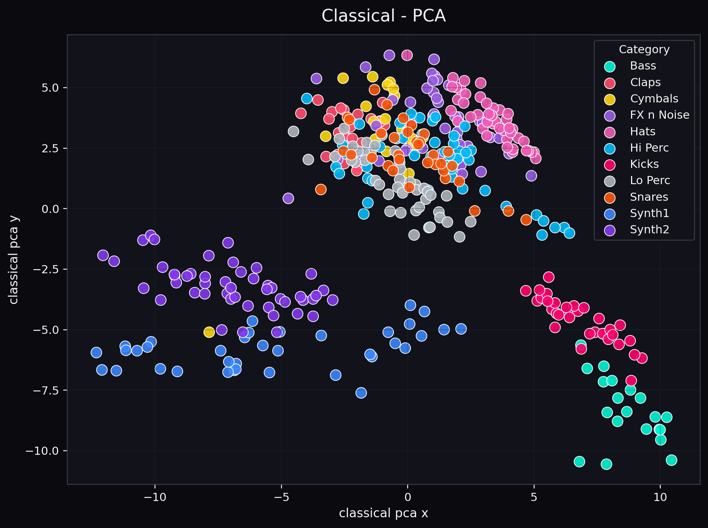
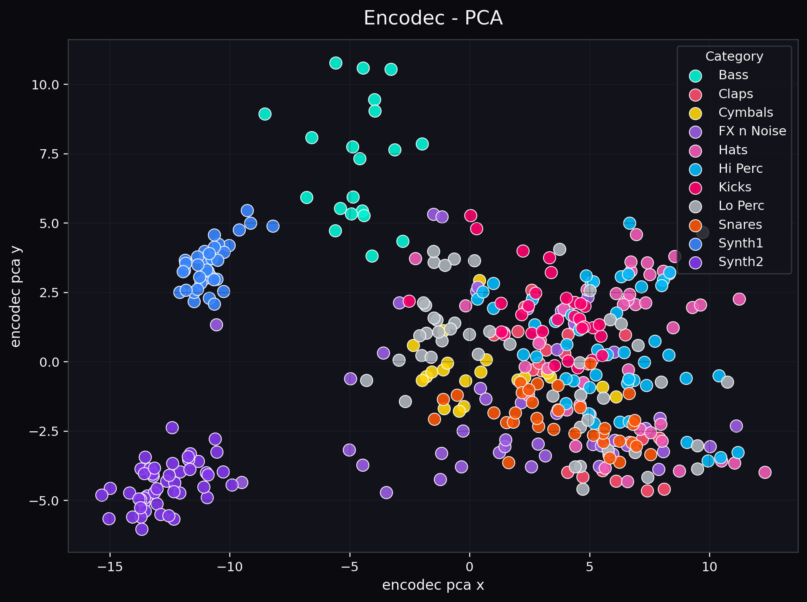
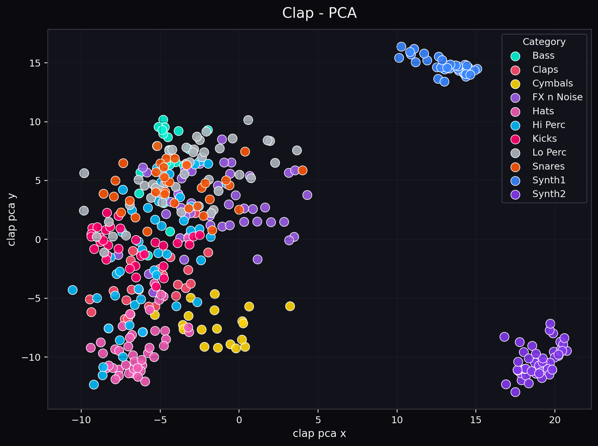

# **Representation Quality for Generative Audio Workflows: A Comparative Study of Classical Features, Encodec Features, and CLAP Embeddings on a Manually Curated Techno Dataset**

Martina Delgado Cabrerizo

---------
To have a better visualization of the tables and images, is necessary to clone this [Github Repo](https://github.com/martiinsssssss/techno-representation.git) and read the file firectly from it. Also, it provides the full implementation used in this project The most important component for exploration is the main notebook (techno_audio_representations.ipynb), where the full pipeline can be run and modified interactively.

--------

## Abstract

This project compares three audio representation families for generative-audio preparation tasks on a manually curated techno one-shot dataset from MusicRadar (399 files, 11 classes): classical descriptors, Encodec features, and CLAP embeddings. Each representation is evaluated with PCA/UMAP visualization, silhouette score, pairwise class-separation analysis, cross-validated supervised classification, and nearest-neighbor listening checks. The results are consistent across methods: CLAP performs best (silhouette 0.3006, accuracy 0.9824, macro-F1 0.9840), classical features rank second, and Encodec ranks third for this task. The study provides an actionable conclusion for dataset navigation and future conditioning strategies in creative ML workflows.

## Introduction

This report examines a practical pre-modeling question in generative audio: which feature space gives the most useful structure for sample organization, retrieval, and class-aware analysis. I compare classical descriptors, Encodec features, and CLAP embeddings on a manually curated MusicRadar techno one-shot dataset, using a shared evaluation pipeline with unsupervised, supervised, and qualitative tests. I chose this topic because I personally enjoy techno, and that motivation guided both manual curation and listening-based validation.

## 1. Background and Related Literature

Representation choice strongly affects clustering, retrieval, and conditioning in generative-audio workflows. This study compares three paradigms used in current literature: classical MIR descriptors (interpretable but limited at high-level semantics), neural codec features from Encodec (optimized for compact reconstruction-oriented latents), and CLAP embeddings (contrastive audio-language representations that often capture perceptual-semantic structure). The goal is to determine which space best preserves class-relevant organization for this dataset before any generation model is trained.

## 2. Why?

The question is enabling and difficult. Many one-shot classes in electronic music partially overlap in timbre (for example hats vs high percussion), so class boundaries are musically meaningful but acoustically fuzzy. A better representation can immediately improve sample retrieval, curation, and conditioning design for downstream generative models.

## 3. Methodology

### 3.1 Dataset

The dataset was manually curated from royalty-free MusicRadar packs and contains 399 one-shots in 11 classes: Bass, Claps, Cymbals, FX n Noise, Hats, Hi Perc, Kicks, Lo Perc, Snares, Synth1, and Synth2. Class counts are moderately imbalanced (range: 20 to 48 samples per class).

### 3.2 Evaluation

I compared the three feature spaces—classical, Encodec, and CLAP—through a combination of unsupervised, supervised, and qualitative analyses. First, I used PCA and UMAP projections to obtain linear and nonlinear two-dimensional views of class geometry. Second, I computed silhouette score as a global unsupervised measure of class separation. Third, I performed pairwise class-separation analysis using centroid-distance heatmaps and nearest/farthest class pairs. Fourth, I trained a Logistic Regression classifier with 5-fold stratified cross-validation and reported accuracy and macro-F1. Finally, I carried out a nearest-neighbor qualitative test using selected query sounds and their top neighbors in each feature space, together with listening examples.

## 4. Visual and Sonic Examples

### 4.1 PCA Projections

PCA provides a linear baseline for comparing global class structure.

  
  
  

<em>Figure 1. PCA projections for classical, Encodec, and CLAP features.</em>

### 4.2 UMAP Projections

UMAP complements PCA with a nonlinear view of local neighborhood structure.

  
  
  

<em>Figure 2. UMAP projections for classical, Encodec, and CLAP features.</em>

### 4.3 Sonic Examples

To complement visual analysis, I included listening queries for nearest-neighbor inspection.

**Kick query**  
<audio controls src="data/music_radar/Kicks/kicks_001.wav"></audio>

**Hat query**  
<audio controls src="data/music_radar/Hats/hats_001.wav"></audio>

**Synth query**  
<audio controls src="data/music_radar/Synth1/synth1_001.wav"></audio>

These examples were used to verify both label consistency and perceptual coherence. Detailed neighbor outputs are in [data/features_musicradar/nearest_neighbor_report.csv](data/features_musicradar/nearest_neighbor_report.csv).

## 5. Results

The results show a stable and repeated ranking across all experiments. CLAP is strongest in unsupervised structure, supervised prediction, and qualitative retrieval behavior. Classical features are second and remain useful for several practical tasks. Encodec is third for this particular setup, even though it remains relevant for reconstruction-oriented pipelines.

### 5.1 Unsupervised global structure

In the unsupervised analysis, CLAP yields the strongest class separation with a silhouette score of 0.3006. Classical features are lower at 0.0947, and Encodec is lowest at 0.0286. This gap indicates that CLAP creates a feature geometry where points from the same class are relatively closer and points from different classes are relatively farther.

| Representation | Silhouette |
|---|---:|
| CLAP | 0.3006 |
| Classical | 0.0947 |
| Encodec | 0.0286 |

The visual evidence in PCA and UMAP supports this result. CLAP tends to form denser and more separated class islands, especially for classes with clear production roles. Classical features produce partially meaningful separation but with broader overlaps, especially among percussive/noisy classes. Encodec appears to not perform well in this dataset, with weaker boundaries between nearby categories.

### 5.2 Supervised benchmark

The supervised benchmark confirms the same pattern. Using 5-fold cross-validated Logistic Regression, CLAP again performs best, with 0.9824 mean accuracy and 0.9840 mean macro-F1. Classical features remain relatively strong, with 0.9623 accuracy and 0.9666 macro-F1. Encodec is clearly below the other two, with 0.7969 accuracy and 0.8078 macro-F1.

| Representation | Accuracy (mean) | Macro-F1 (mean) |
|---|---:|---:|
| CLAP | 0.9824 | 0.9840 |
| Classical | 0.9623 | 0.9666 |
| Encodec | 0.7969 | 0.8078 |

The macro-F1 behavior is important because it reduces the risk that performance is driven only by larger classes. CLAP improves not only overall accuracy but also class-balanced quality, suggesting that the learned embedding captures useful information for both frequent and less frequent categories.

### 5.3 Pairwise class-separation behavior

The pairwise class analysis provides a more local explanation for these outcomes. In the CLAP space, the most confused-like pairs include FX n Noise-Lo Perc and Hi Perc-Lo Perc. This is musically meaningful because these classes can share broad-band noise content and similar transient profiles. In contrast, CLAP strongly separates pairs such as Bass-Synth2 and Kicks-Synth1, where envelope and timbral identity are more different.

This is a useful practical signal: the method struggles mostly where humans also perceive category boundaries as fuzzy, and performs very well where categories are structurally distinct. That pattern increases trust in the representation for real curation and retrieval tasks.

### 5.4 Nearest-neighbor qualitative findings

Nearest-neighbor retrieval supports the quantitative findings. For kicks_001.wav, CLAP and classical mostly return kick-consistent neighbors, while Encodec includes more mixed results such as Bass and Lo Perc in high ranks. For hats_001.wav, all spaces are reasonably coherent, but CLAP shows stronger neighborhood compactness. For synth1_001.wav, CLAP returns highly consistent Synth1 neighbors with small distances.

These listening-based observations matter because producer workflows are often retrieval-first: users browse similar samples, compare local neighborhoods, and only then generate or transform material. A representation that gives coherent neighbors improves speed, trust, and creative control.

### 5.5 Summary

Across unsupervised, supervised, and qualitative probes, the evidence showcase the same conclusion. CLAP is the most effective representation in this manually curated techno one-shot dataset. Classical features remain a strong and interpretable baseline with low computational cost. Encodec latents likely need additional task-specific adaptation, or a different downstream objective, to match CLAP in class-structured retrieval and classification.

From a workflow perspective, this ranking changes concrete decisions in the project pipeline. CLAP can be used as the default space for interactive browsing, nearest-sample suggestion, and class-aware dataset audits before training any generator. Classical descriptors remain valuable as lightweight diagnostics because they are interpretable and fast. Encodec features are still useful when reconstruction is primary, but they require additional adaptation for robust class-structured navigation in small curated techno datasets.

## 6. Reflection, Limitations, and Future Directions

For this dataset and protocol, CLAP is the most useful representation, with classical features as a strong interpretable baseline. Encodec likely requires a different downstream objective or adaptation to compete on class-structured retrieval/classification.

Key limitations are dataset scale (399 samples), partial label subjectivity, focus on one-shots rather than temporal structure, and centroid-based simplification of class geometry.

Future work includes comparing additional embeddings (for example VGGish), analyzing Encodec codebook behavior more directly, testing class-conditioned sequence models on codec latents, and extending evaluation to generated audio (for example FAD or embedding-based diagnostics).

## 7. Conclusion

Representation choice strongly affects downstream generative-audio workflows. In this project, CLAP provided the clearest structure across unsupervised, supervised, and qualitative retrieval analyses, making it a strong candidate for future conditioning and dataset-navigation tasks. The study is exploratory, but it is also actionable: it provides a concrete representation decision and a reproducible analysis framework for the next stage of generative experiments.

## References

- Wu, Y., Chen, K., Zhang, T., Hui, Y., Berg-Kirkpatrick, T., & Dubnov, S. (2023, June). *Large-scale contrastive language-audio pretraining with feature fusion and keyword-to-caption augmentation*. In *ICASSP 2023-2023 IEEE International Conference on Acoustics, Speech and Signal Processing (ICASSP)* (pp. 1-5). IEEE.
- MusicRadar. *Free music samples: royalty-free loops, hits and multis to download (SampleRadar)*. https://www.musicradar.com/news/tech/free-music-samples-royalty-free-loops-hits-and-multis-to-download-sampleradar
- Tzanetakis, G., & Cook, P. *Musical Genre Classification of Audio Signals*. [Submitted on 24 Oct 2022].
- Defossez, A., Copet, J., Synnaeve, G., & Adi, Y. *High Fidelity Neural Audio Compression*.